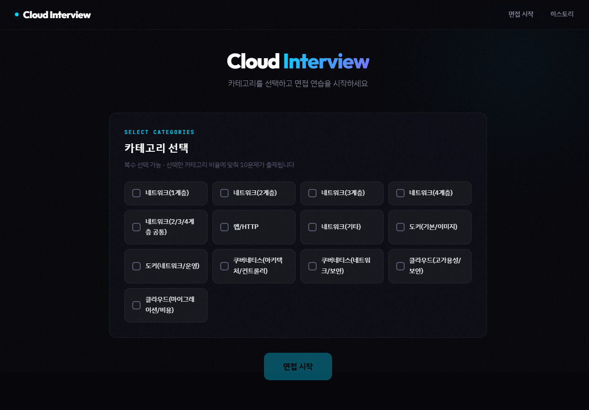
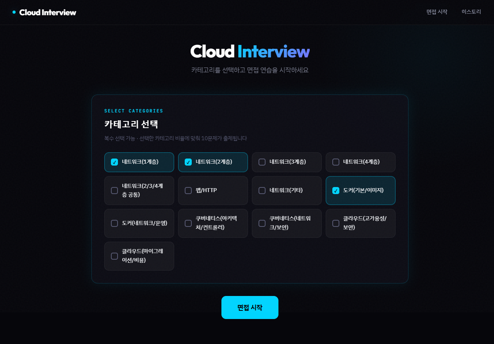
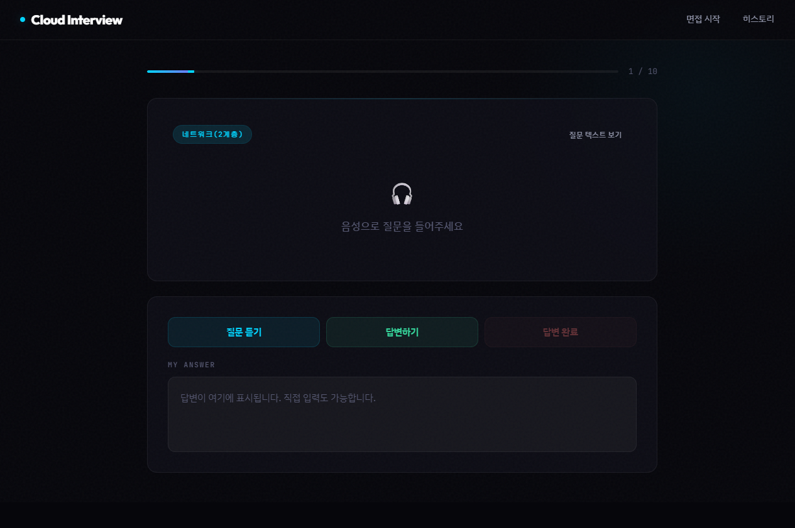
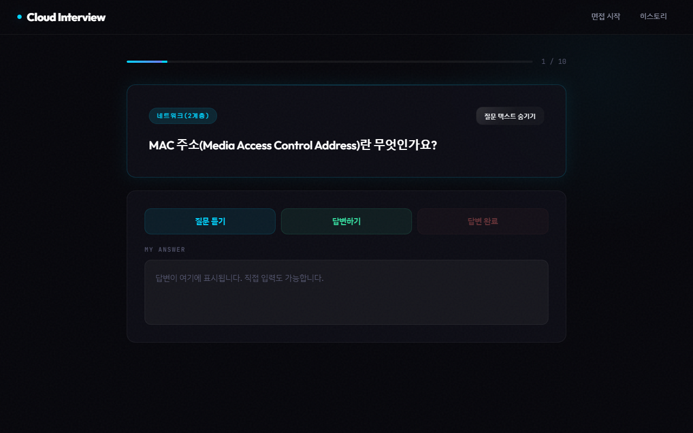
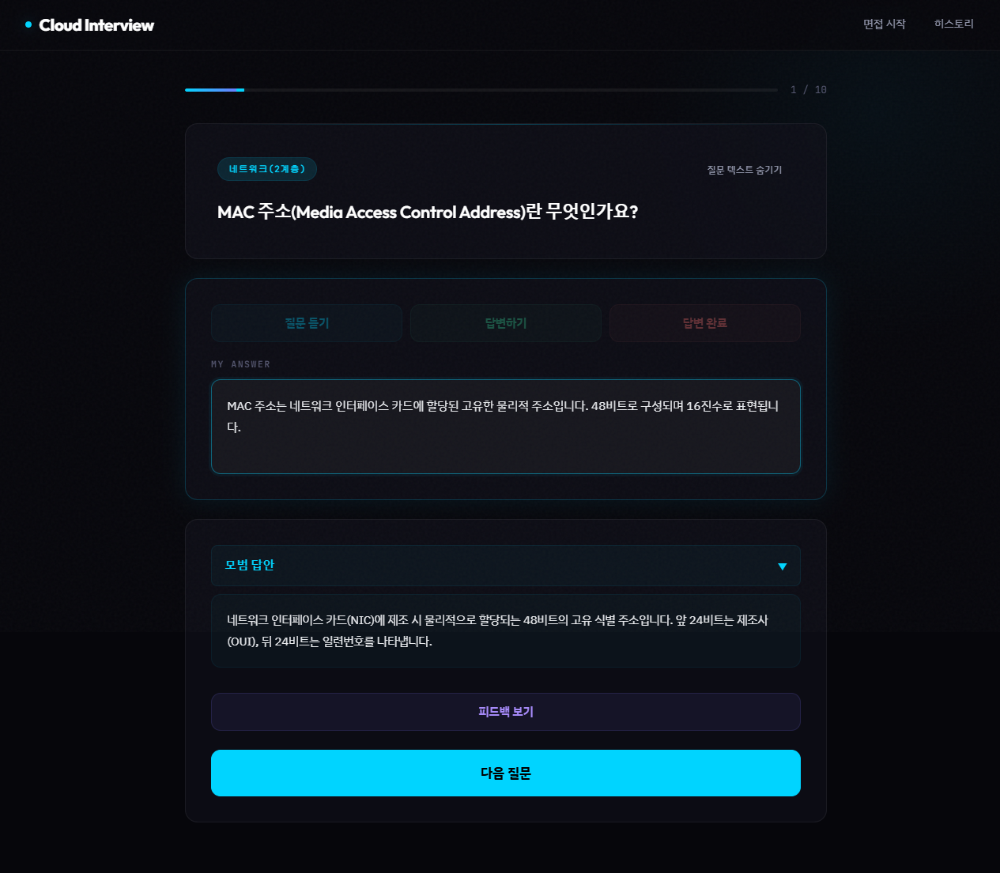
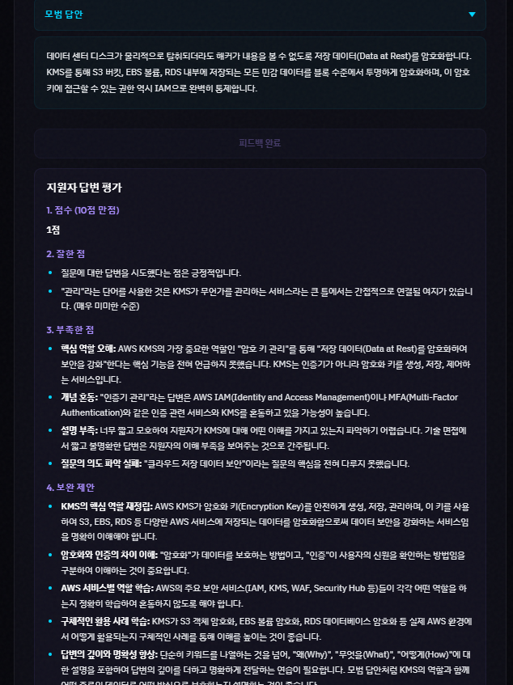
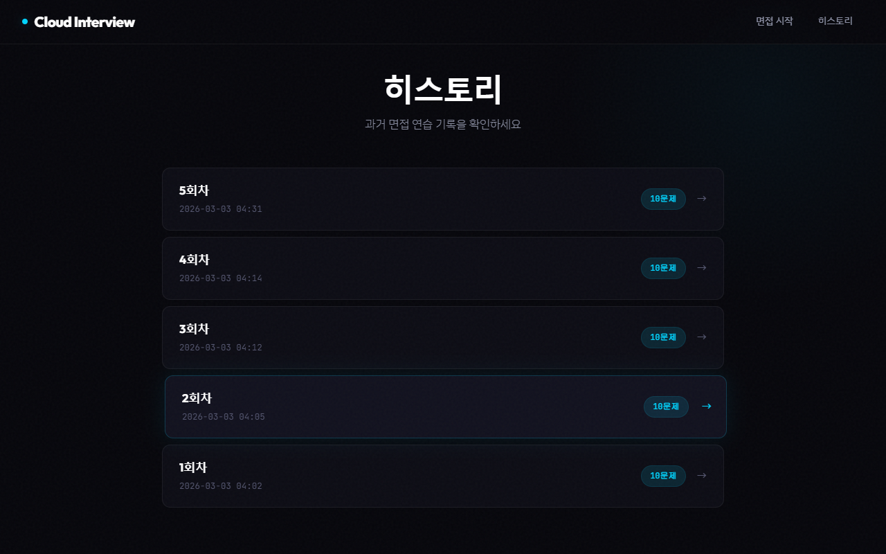
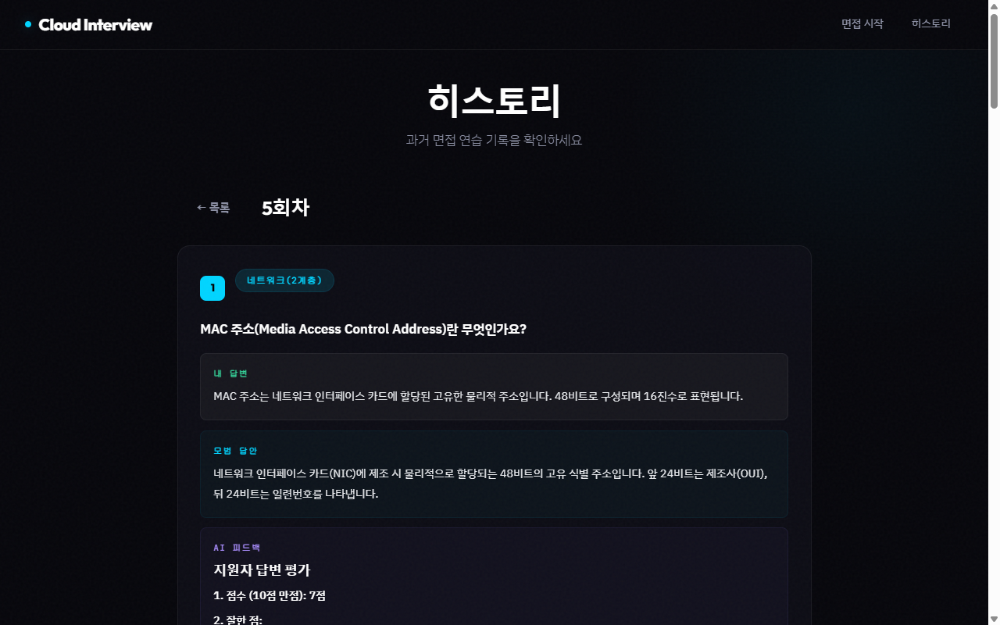

# Cloud Interview

IT 인프라/클라우드 면접 연습 웹 애플리케이션

실제 면접처럼 음성으로 질문을 듣고, 음성으로 답변하며, AI 피드백을 받을 수 있는 개인용 면접 연습 도구입니다.



## 주요 기능

- **카테고리 기반 문제 출제** — 네트워크(1~4계층), 웹/HTTP, 도커, 쿠버네티스, 클라우드 아키텍처 등 카테고리를 복수 선택하면 비율에 맞춰 10문제 출제
- **음성 면접** — edge-tts(MS Neural 음성)로 질문을 읽어주고, Web Speech API(STT)로 답변을 음성 인식 (질문 텍스트는 기본 숨김, 실제 면접처럼 음성으로만 진행)
- **AI 피드백** — 답변 완료 후 모범 답안 확인 + Gemini API로 점수/잘한 점/부족한 점/보완 제안 피드백 생성
- **히스토리** — 회차별 면접 기록(질문, 내 답변, 모범 답안, 피드백) 조회

## 기술 스택

| 구분 | 기술 |
|------|------|
| Backend | Flask, SQLAlchemy |
| Frontend | Jinja2, Vanilla JS |
| Database | MySQL 8.0 |
| TTS | edge-tts (ko-KR-SunHiNeural) |
| STT | Web Speech API (Chrome) |
| AI 피드백 | Gemini 2.5 Flash |
| Infra | Docker Compose |

## 프로젝트 구조

```
├── docker-compose.yml
├── .env                          # 환경변수 (Gemini API 키)
├── flask/
│   ├── Dockerfile
│   ├── requirements.txt
│   ├── app.py                    # Flask 앱 진입점
│   ├── config.py                 # DB, API 설정
│   ├── models.py                 # SQLAlchemy 모델
│   ├── routes/
│   │   ├── main.py               # 메인 페이지, 카테고리, 면접 시작
│   │   ├── interview.py          # 면접 진행, TTS, 답변 저장, 피드백
│   │   └── history.py            # 히스토리 조회
│   ├── services/
│   │   └── gemini_service.py     # Gemini API 피드백 생성
│   ├── templates/                # Jinja2 HTML 템플릿
│   └── static/                   # CSS, JS
└── mysql/
    ├── 01_schema.sql             # 테이블 생성
    └── 02_seed.sql               # 초기 질문 데이터 (79문제)
```

## 실행 방법

### 방법 1. Docker Hub 이미지 사용 (권장)

소스 코드 없이 이미지만으로 바로 실행할 수 있습니다.

**1) docker-compose.yml 작성**

```yaml
services:
  mysql:
    image: yhk0427/interview-mysql:latest
    restart: always
    environment:
      MYSQL_ROOT_PASSWORD: ${MYSQL_ROOT_PASSWORD}
      MYSQL_DATABASE: ${MYSQL_DATABASE}
    ports:
      - "3306:3306"
    volumes:
      - mysql_data:/var/lib/mysql
    healthcheck:
      test: ["CMD", "mysqladmin", "ping", "-h", "localhost"]
      interval: 10s
      timeout: 5s
      retries: 5

  flask:
    image: yhk0427/interview-flask:latest
    restart: always
    ports:
      - "5000:5000"
    environment:
      MYSQL_HOST: mysql
      MYSQL_PORT: 3306
      MYSQL_ROOT_PASSWORD: ${MYSQL_ROOT_PASSWORD}
      MYSQL_DATABASE: ${MYSQL_DATABASE}
      GEMINI_API_KEY: ${GEMINI_API_KEY}
    depends_on:
      mysql:
        condition: service_healthy

volumes:
  mysql_data:
```

**2) .env 파일 생성**

```env
MYSQL_ROOT_PASSWORD=root
MYSQL_DATABASE=interview_db
GEMINI_API_KEY=여기에_본인_API키_입력
```

> Gemini API 키는 [Google AI Studio](https://aistudio.google.com/)에서 무료 발급

**3) 실행**

```bash
docker-compose up -d
```

**4) 접속**

브라우저에서 `http://localhost:5000` 접속 (Chrome 권장 — STT 지원)

---

### 방법 2. 소스에서 직접 빌드

```bash
git clone https://github.com/YHK0427/cloud-interview.git
cd cloud-interview
```

`.env` 파일을 프로젝트 루트에 생성 (위 방법 1의 .env 동일)

```bash
docker-compose up --build
```

## 데이터베이스

### questions 테이블
| 컬럼 | 타입 | 설명 |
|------|------|------|
| id | INT (PK) | 질문 ID |
| question | TEXT | 질문 내용 |
| model_answer | TEXT | 모범 답안 |
| category | VARCHAR(50) | 카테고리 |

### answers 테이블
| 컬럼 | 타입 | 설명 |
|------|------|------|
| id | INT (PK) | 답변 ID |
| question_id | INT (FK) | 질문 참조 |
| answer | TEXT | 사용자 답변 |
| feedback | TEXT | AI 피드백 |
| session_no | INT | 회차 번호 |

### 질문 추가

```sql
INSERT INTO questions (question, model_answer, category) VALUES
('질문 내용', '모범 답안 내용', '카테고리명');
```

## 카테고리 목록 (초기 데이터 기준)

- 네트워크(1계층) ~ 네트워크(4계층)
- 네트워크(2/3/4계층 공통)
- 네트워크(기타)
- 웹/HTTP
- 도커(기본/이미지)
- 도커(네트워크/운영)
- 쿠버네티스(아키텍처/컨트롤러)
- 쿠버네티스(네트워크/보안)
- 클라우드(고가용성/보안)
- 클라우드(마이그레이션/비용)

## 사용자 가이드

### Step 1. 카테고리 선택

원하는 카테고리를 복수 선택한 뒤 **면접 시작** 버튼을 클릭합니다.
선택한 카테고리 비율에 맞춰 총 10문제가 랜덤 출제됩니다.



### Step 2. 면접 진행

면접이 시작되면 질문 텍스트는 숨겨져 있습니다. 실제 면접처럼 **질문 듣기** 버튼을 눌러 음성으로 질문을 듣고, **답변하기** 버튼을 눌러 음성으로 답변합니다.



필요시 **질문 텍스트 보기** 버튼으로 질문 내용을 확인할 수 있습니다.



### Step 3. 답변 확인 및 피드백

**답변 완료** 후 모범 답안을 확인하고, **피드백 보기** 버튼으로 AI 피드백(점수, 잘한 점, 부족한 점, 보완 제안)을 받습니다.





### Step 4. 히스토리 확인

메뉴의 **히스토리**에서 과거 면접 기록을 회차별로 조회할 수 있습니다.



각 회차를 클릭하면 질문별 내 답변, 모범 답안, AI 피드백을 다시 확인할 수 있습니다.



---

## Kubernetes 배포

Docker Compose 환경에서 AKS(Azure Kubernetes Service)로 마이그레이션하였습니다.

### 아키텍처 구조도


### K8s 매니페스트 구조

```
kubernetes/
├── deployment/
│   ├── flask-deployment.yaml          # Flask Deployment (Burstable, 2 replicas)
│   └── mysql-deployment.yaml          # MySQL Deployment (Guaranteed, 1 replica)
├── svc/
│   ├── flask-svc.yaml                 # ClusterIP :5000
│   └── mysql-svc.yaml                 # ClusterIP :3306
├── secret_configmap/
│   ├── flask-configmap-secret.yaml    # Flask 환경변수 + Secret (gitignored)
│   ├── mysql-configmap-secret.yaml    # MySQL 환경변수 + Secret (gitignored)
│   ├── flask-configmap-secret.yaml.ex # 예시 파일
│   └── mysql-configmap-secret.yaml.ex # 예시 파일
├── volume/
│   └── pvc.yaml                       # MySQL PVC 5Gi (managed-csi)
├── Gateway/
│   ├── gateway.yaml                   # Traefik Gateway (HTTP/HTTPS)
│   ├── httproute.yaml                 # HTTPRoute: /* → flask:5000
│   ├── tls.crt / tls.key              # 자체 서명 인증서 (gitignored)
│   └── tls.crt.ex / tls.key.ex        # 예시 파일
├── networkPolicy/
│   ├── default-deny.yaml              # 기본 전체 차단
│   ├── flask-policy.yaml              # Flask 허용 규칙
│   ├── mysql-policy.yaml              # MySQL 허용 규칙
│   └── traefik-policy.yaml            # Traefik 허용 규칙
├── RBAC/
│   └── rbac.yaml                      # ServiceAccount (flask-sa, mysql-sa)
├── resourceQuota/
│   └── namespace_rs.yaml              # CPU 1.5 / Mem 2.5Gi
└── traefik/
    ├── traefik-values.yaml            # Helm values (gitignored)
    └── traefik-values.yaml.ex         # 예시 파일
```

### 주요 설계

| 항목 | 구성 |
|------|------|
| Gateway | Traefik + Gateway API, 자체 서명 TLS |
| Flask QoS | Burstable — CPU 200~250m, Mem 256~512Mi, 2 replicas |
| MySQL QoS | Guaranteed — CPU 500m, Mem 1Gi (고정), 1 replica |
| Secret 관리 | MYSQL_USER/PASSWORD → env, GEMINI_API_KEY → 파일 볼륨 마운트 (/etc/secrets) |
| NetworkPolicy | default-deny + 서비스별 화이트리스트 |
| RBAC | 전용 ServiceAccount, automountServiceAccountToken: false |
| 이미지 | yhk0427/interview-flask:1.1, yhk0427/interview-mysql:1.1 (multi-arch: amd64 + arm64) |

---

## Kubernetes 트러블슈팅

### 1. ResourceQuota 리소스 관리

Namespace에 ResourceQuota(CPU 1, Mem 2Gi)를 설정한 뒤 가장 많이 해맸던 부분이다.

**문제 상황:**
- Flask를 2개 replicas로 배포했더니 CPU limits 합계가 Quota 전체를 소진해버림. pod 하나 당 limit을 잡아 먹는다는 사실을 망갹
- MySQL Pod가 스케줄링되지 않고, PVC도 계속 Pending 상태. MySql deploy를 나중에 띄워서 환경변수 문제인건지 무엇이 문제인건지 매우 헷갈렸었음. 하지만 위가 이유가 됨
- Traefik을 Helm으로 설치했는데, Helm 차트에 resource limits가 없어서 `must specify limits` 에러로 Pod 생성이 안됨


**해결 과정:**
1. 전체 Quota를 CPU 1.5 / Mem 2.5Gi로 상향
2. Flask를 Burstable로 변경 — requests/limits 차이를 두어 리소스 절약 (CPU 200~250m, Mem 256~512Mi)
3. MySQL은 Guaranteed 유지 — DB 안정성을 위해 requests = limits 고정 (CPU 500m, Mem 1Gi)
4. Traefik Helm values에 resource limits 직접 추가
5. 전체 합산이 Quota 를 명확히 메모해두고 설계

**배운 점:**
- ResourceQuota가 걸린 Namespace에서는 모든 컨테이너에 requests/limits가 필수
- 설계 시점에서 리소스 또한 모두 정해놓고 할 것

### 2. NetworkPolicy egress에서 DNS(port 53) 누락

default-deny NetworkPolicy를 적용하고 서비스별로 허용 규칙을 하나씩 추가하는 방식으로 진행. 

**문제 상황:**
- Flask에서 외부 API(Gemini, Edge TTS) 호출을 위해 egress에 443 포트를 허용
- 적용 후에도 외부 API 연결이 계속 실패
- 이전 서비스를 loadbalancer로 기능 테스트 해보았을 때는 되었어서 내부적 안의 문제일거라 판단하게 화근이였음

**원인:**
- 외부 호출하면 DNS 이름 해석이 먼저 일어나는데, egress에 UDP(53번포트)를 허용하지 않아서 도메인 해석을 아예 못함
- 443을 열어도 도메인을 IP로 변환할 수가 없으니 api 사용이 제한됨

**해결:**

- flask-policy.yaml egress 규칙에 DNS 허용 추가


**배운 점:**
- 외부 api를 사용하는 경우 NetworkPolicy에서 egress를 제한할 때 DNS(53) 무조건 열어줄 것
- "443 열었는데 왜 안 되지?" 싶으면 DNS부터 의심할 것
- ingress, egress가 안될 때 조금 더 다각화된 시선으로 트러블 슈팅을 할 수 있을 것 같음